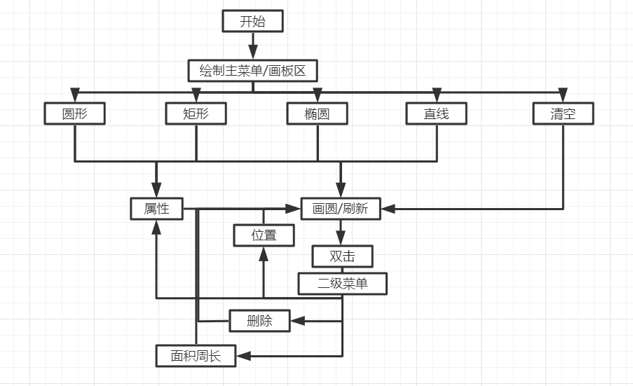
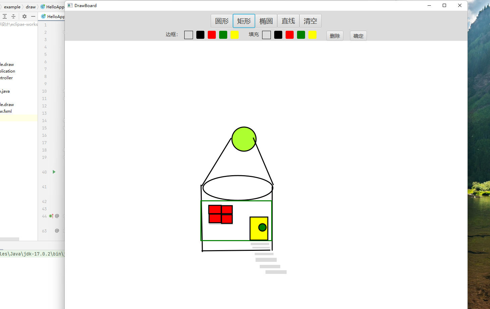

# DrawingBoard
**主要思路：  
本程序主要使用Circle，Line等类对Shape类的继承，和Shape类多态实现  
在传递参数时，直接使用Shape，可以实现所有图形公用画图，拖动，改变属性等方法  
   
**此版本仍存在以下问题：  
1.	坐标显示功能。只能显示/不显示，不能持续显示，不能随图形移动而移动  
解决思路：  
设计新的Shaped类，继承Shape类，增加一个Label，每次更新的时候，就可以把面积，周长同步更新  
新建Arraylist <Label>,存放所有图形的面积周长，每次在group里更新数组  
2.按下按钮后，只能画一次图，暂时没有解方案  
3.因为是用Group存放图形，所以存在图形覆盖菜单的情况  
  
    
Java 程序设计上机作业<"\n">
作业六：GUI 画板的设计与实现
画板是我们日常生活中经常使用的一类软件，其中最具代表性的
就是微软 Windows 操作系统内置的画板（mspaint），请各位同学根据
下面的要求，完成一个图形用户界面的画板软件的设计和实现：
（1）程序由一个主窗口构成，主窗口中主要显示一个绘制区域，
用户的所有绘制操作都在绘制区域中完成；在窗口内或者窗口外可以
通过创建菜单、创建子面板等方式为用户提供画板相关功能的选择按
钮、设置项或者菜单选项；
（2）该画板中可以绘制的图形包括圆形（含椭圆）、矩形（含正
方形）、直线和点，每个图形都需要保存位置、大小几何属性及是否
填充、填充颜色、是否绘制边框和边框颜色等必要属性，用户通过选
择按钮或者菜单项选中要绘制的图形，并且设置边框、填充属性，然
后在绘制区域中通过鼠标拖放的方式创建图形；
（3）所有图形按照创建顺序和属性值绘制在绘制区域中，位置
出现重叠的图形后绘制的要覆盖先绘制图形区域的内容；
（4）每个图形在绘制后，都可以通过数遍左键双击的方式选中，
处于选中状态的图形可以通过鼠标拖放的方式移动位置，或者通过菜
单、按钮等方式重新设置填充、边框属性，或者点击 del 按钮删除，
但图形大小可不需要修改（如可实现图形大小的修改，则有额外加分）；
（5）可以通过菜单或者按钮选择的方式，设置所有绘制图形的
面积和周长显示/不显示在图形内；
（6）提供保存和读取功能，保存功能能够将用户所绘制的各类
图形顺序和属性保存在文件中（文件结构自行设计），也可通过读取
功能从文件中将图形顺序和属性读入程序并且进行绘制；  
 
